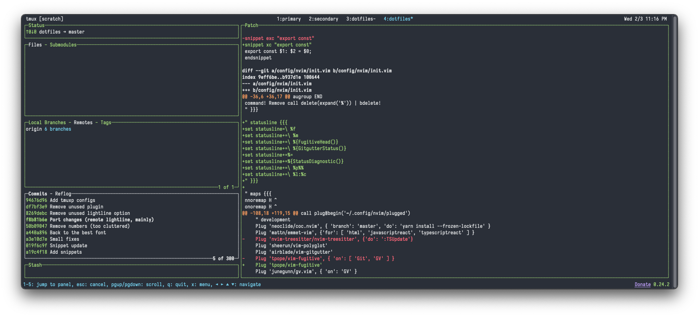
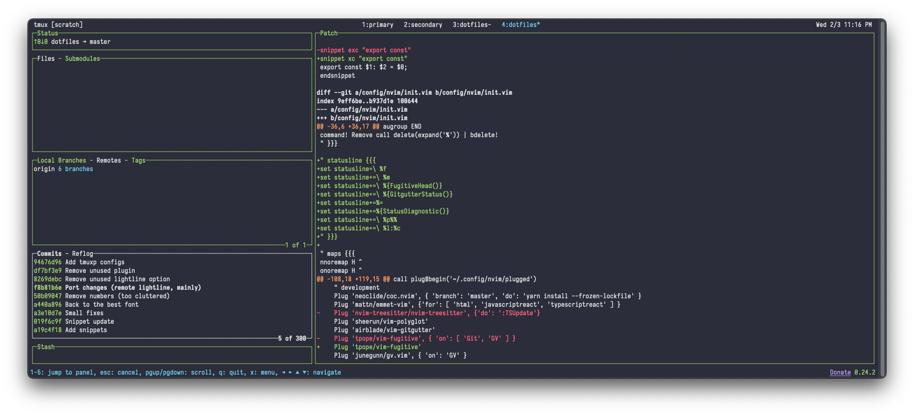
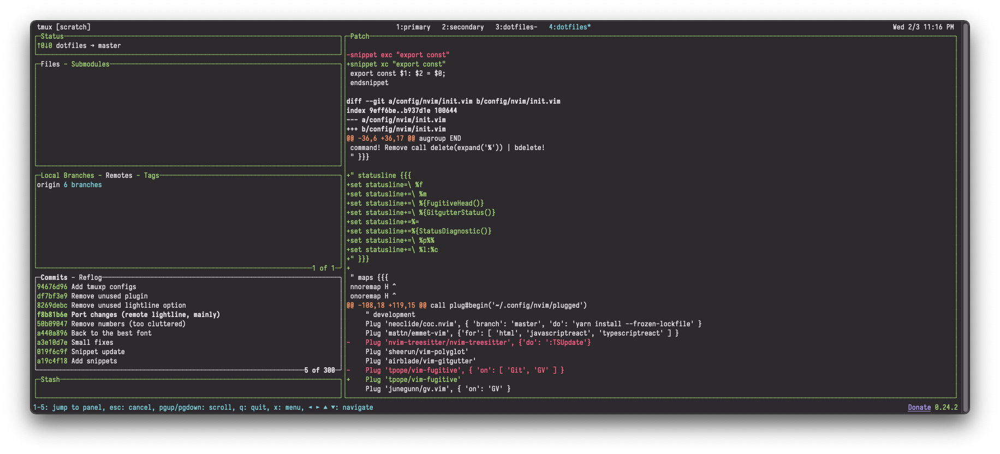
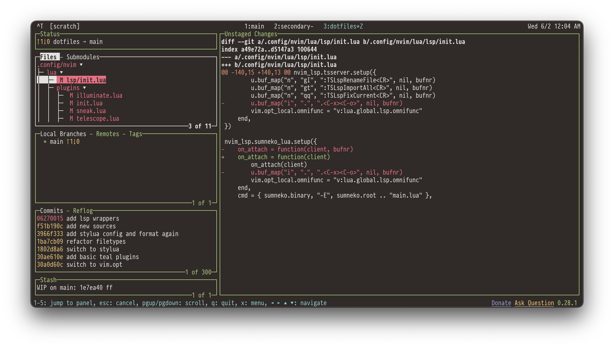

# sonokai-iterm2

A simple port of [@sainnhe](https://github.com/sainnhe)'s fantastic
[sonokai](https://github.com/sainnhe/sonokai) Vim colorscheme to iTerm2 (ported
directly from his Alacritty colors).

## Installation

Download whichever variation you prefer (or, better yet, download them all) from
iTerm2/ and open the .itermcolors file(s) in Finder to import into iTerm2.

Select the newly imported colorscheme from Settings -> Profiles -> Colors ->
Color Presets.

## Screenshots

### Default

### Atlantis

### Andromeda

### Shusia

### Maia

### Espresso

